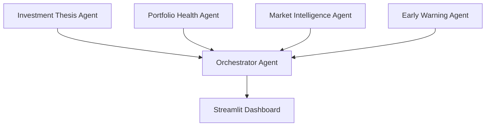

# Agentic AI Portfolio Guardian

Retail investors usually buy a stock based on a thesis (e.g. "this company
will benefit from EV adoption"), but rarely revisit whether that thesis
still holds as news, fundamentals, and market conditions change. This
project builds a multi-agent system that continuously re-checks the
original reasoning behind each holding using live market data, financial
news, and portfolio composition — surfacing what has changed and why,
**without issuing direct buy/sell recommendations**.

## Architecture



Four specialized agents coordinated by a central Orchestrator, built with
LangGraph (`src/orchestrator.py`) so state and control flow between
agents stays explicit and traceable. The graph runs sequentially —
Portfolio Health → Thesis → Market Intelligence → Early Warning → Merge
— and each node catches its own failures (Ollama unreachable, missing
thesis, no news) and records them in a shared `errors` list rather than
crashing the run, so partial results still make it to the dashboard. See
`docs/decisions/` for the ADR behind each agent and `app.py` for how the
merged output is rendered.

| Agent | Role | Status |
|---|---|---|
| Investment Thesis Agent | Tracks whether the original reason a user invested still holds against current data | Completed |
| Portfolio Health Agent | Evaluates diversification and risk exposure across the full portfolio | Completed |
| Market Intelligence Agent | Reads live news/market updates and summarizes what's relevant to each holding | Completed |
| Early Warning Agent | Flags red flags: management changes, litigation, credit downgrades | Completed |
| Orchestrator Agent | Combines all four agents' outputs into one coherent, user-facing insight via LangGraph | Completed |

## Tech stack
- Python 3.x
- LangGraph (agent orchestration)
- LLM: Ollama v0.32.4 (Local) — `llama3.2:latest`
- Embeddings: sentence-transformers, contrastively fine-tuned relevance model
  hosted on Hugging Face Hub
- Data: yfinance, NewsAPI
- Dashboard/UI: Streamlit + Plotly

## Relevance filtering
News is filtered for relevance to each investment thesis using embedding
similarity rather than keyword matching, which fails on "hard negative"
cases (news about the same company that's unrelated to the specific
thesis). A contrastively fine-tuned model
(`navneet11/contrastive-relevance-v1`, hosted privately on Hugging Face
Hub) replaced an initial generic-embedding placeholder after evaluation
showed clean separation between relevant and irrelevant news, including
on hard negatives. See `docs/decisions/0002-...MD` and
`docs/decisions/0003-...MD` for the full methodology and evaluation.

## Data sources
- Live market/news: yfinance (NSE/BSE), NewsAPI
- Financial PhraseBank (~4,840 expert-labeled sentences) — sentiment benchmark
- Historical NSE data (1,700+ stocks, 1990–2021) — backtesting


## Evaluation

Full methodology and per-fold numbers are in `docs/decisions/0011-evaluation-vader-clustering-loto-breakdown.md`.

### Sentiment tagging (Financial PhraseBank, 970 held-out sentences)
| Method | Accuracy |
|---|---|
| VADER (lexicon, ±0.05 cutoff) | 52.99% (514/970) |
| Generic embedding (untrained, nearest-centroid) | 65.36% (634/970) |
| Contrastive embedding (fine-tuned, nearest-centroid) | **83.71% (812/970)** |

Notably, VADER scores *below* the untrained generic-embedding baseline -
not the result you'd expect from a purpose-built sentiment tool. Most
likely cause: VADER's lexicon is tuned for informal/social-media text,
while PhraseBank sentences use flat financial language that doesn't
trigger it well, especially the majority `neutral` class. Not
root-caused further (e.g. no per-class VADER confusion matrix yet).

### Embedding clustering quality (same val set)
| Metric | Baseline (generic) | Contrastive (fine-tuned) |
|---|---|---|
| Silhouette (vs true labels) | -0.0058 | 0.3133 |
| Silhouette (vs KMeans clusters) | 0.0681 | 0.4525 |
| Purity (KMeans k=3 vs true labels) | 0.5938 | 0.8258 |

The baseline's near-zero silhouette means the 3 sentiment classes are
essentially unseparated in the untrained embedding space - consistent
with its weaker classification accuracy above.

### Relevance model: LOTO per-fold, easy vs hard negatives
Average across 8 leave-one-thesis-out folds: **96.88% combined**
(matches ADR 0003's original blended number), but broken down:
- Easy negatives: **100%** in every fold
- Hard negatives: **93.75% average**, but not uniform - `t6_adanigreen_renewables`
  (91.7%), `t7_itc_fmcg` (75.0%), and `t8_dlf_realestate` (83.3%) are
  meaningfully weaker than the other 5 folds, which hit 100% hard-negative
  accuracy.

This means the strong headline number hides a real, uneven weak spot
specifically on the same-company/thesis-irrelevant case the model was
built to handle - not yet root-caused (small 12-triplet-per-fold sample,
or something specific to those sectors/theses). Flagged as an open item,
not treated as resolved.

## Limitations
- NewsAPI free tier restricts article recency and request volume
- yfinance can be inconsistent/rate-limited for NSE/BSE tickers
- When both fundamentals and news data are sparse or unavailable, the LLM
  may produce confident-sounding but unsubstantiated claims rather than
  flagging insufficient data (observed during testing, not yet mitigated)
- Contrastive relevance model trained on a small dataset (8 investment
  theses) - strong held-out evaluation results, but not yet validated at scale
- Not intended as investment advice; outputs are informational only

## Decision log
Every meaningful design decision is recorded in `docs/decisions/` as an
ADR (Architecture Decision Record) — see `docs/decisions/template.md` for
the format. Read these before making changes; they capture *why*, not just
*what*.

Real-run validation notes (spot-checks, failure-mode testing) are recorded
separately in `docs/validation/`.

## Project structure
```
src/agents/            individual agent implementations
src/orchestrator.py     LangGraph orchestrator wiring all 4 agents together
app.py                  Streamlit dashboard - reads orchestrator output
docs/decisions/         ADRs — one file per decision
data/theses.json        per-ticker investment theses (one line each)
requirements.txt
.env.example            copy to .env and fill in your API keys
```

## Setup
```
pip install -r requirements.txt
cp .env.example .env # then fill in your keys
```
## Running the full app
Make sure Ollama is running (`ollama serve`, or the desktop app) before
starting the dashboard — the Thesis and Market Intelligence sections
depend on it for reasoning/summaries; the app still runs and degrades
gracefully if Ollama is unreachable, but you'll only see Portfolio
Health populated.

```
streamlit run app.py
```

The app opens with a single-screen **Dashboard** page (portfolio health
score, allocation, performance/risk, market pulse, alert strip) that's
intentionally non-scrolling — it's meant to be read at a glance. Click
"Run Full Analysis" to trigger a full orchestrator run across every
holding in the portfolio (this calls Ollama multiple times per holding,
so it can take a few minutes on CPU).

Full per-holding detail — thesis reasoning, market sentiment/summary, and
red-flag alerts — lives on the separate **Thesis** page, reachable via
the sidebar or the "View full thesis monitor →" link on the dashboard.
A **Settings** page lets you point at a different portfolio CSV, edit
per-ticker theses, and toggle whether live price history / market
metadata get fetched (useful for faster iteration during development).

You can also run the orchestrator standalone without the UI, for faster
debugging:
```
python -m src.orchestrator --file data/sample_portfolio.csv
python -m src.orchestrator --file data/sample_portfolio.csv --no-prices --no-market
```